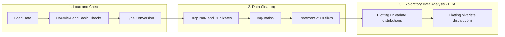
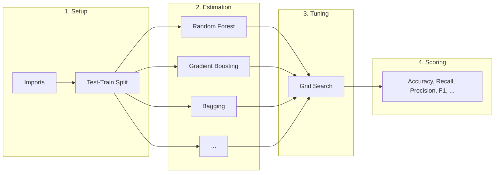

# Snippets for Analytics
## Overview
This collection contains Python snippets for data analytics. The goal is to provide a template to quickly get a preliminary overview of a new data set.

## Data cleaning, overview and EDA
The [Cleaning and EDA](analytics_cleaning_eda.ipynb) snippet contains code to perform basic checks, type conversion, data cleaning incl. imputation and outlier treatment, and exploratory data analysis (EDA).

### Basic workflow

## Ensemble Models
The [Ensemble methods](ensemble_methods.ipynb) snippet provides an example workflow to estimate different ensemble models. The snippet contains sections for 1) setting up a project, including the test-train split, 2) estimation of the models, 3) hyperparameter tuning, and 4) scoring.

### Basic workflow

